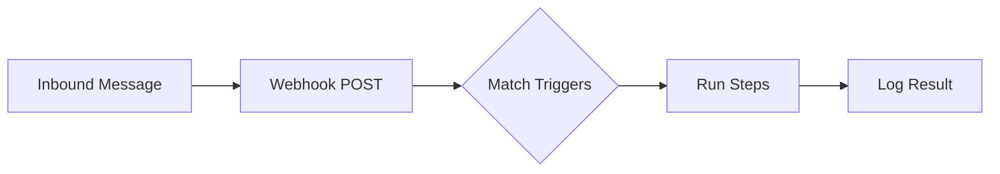

# WACRM Automations — Complete Setup Guide

## How Automations Work

When a WhatsApp message arrives at your webhook, the engine checks all **active** automations matching the trigger type and runs their steps sequentially. Each automation is: **Trigger → Step 1 → Step 2 → … → Done**.



---

## Step 1: Prerequisites

Before creating automations, ensure:

| Requirement | Where to Check |
|---|---|
| ✅ WhatsApp Config connected | **Settings → WhatsApp Config** (phone number ID + access token saved) |
| ✅ Webhook URL registered on Meta | Meta Business Suite → App → WhatsApp → Configuration → Webhook URL = `https://yourdomain.com/api/whatsapp/webhook` |
| ✅ Meta App Secret set | `.env.local` → `META_APP_SECRET=your-meta-app-secret` |
| ✅ Templates synced from Meta | **Settings → Templates → Sync from Meta** (required if you use `Send Template` action) |
| ✅ Tags created | **Settings → Tags** (required if you use `Add Tag` / `Remove Tag` actions) |

---

## Step 2: Create an Automation

1. Navigate to **Automations** in the sidebar
2. Click **"New Automation"** or use a template (like "Welcome Message")
3. Give it a **name** (e.g., "Welcome Message")

---

## Step 3: Choose a Trigger

The trigger determines **when** the automation fires. You get exactly **one trigger** per automation.

| Trigger | When It Fires | Extra Config |
|---|---|---|
| **First Message from Contact** (`first_inbound_message`) | First time this contact ever messages you (works for manually-added contacts too) | None |
| **New Message Received** (`new_message_received`) | Every incoming message from any contact | None |
| **Keyword Match** (`keyword_match`) | Incoming message contains or exactly matches specific keywords | Keywords list, Match type (`exact` or `contains`), Case sensitive toggle |
| **New Contact Created** (`new_contact_created`) | A new contact is automatically created from an inbound message | None |
| **Conversation Assigned** (`conversation_assigned`) | A conversation is assigned to a vendor/agent | None |
| **Tag Added** (`tag_added`) | A specific tag is added to a contact | Tag ID |
| **Time Based** (`time_based`) | On a cron schedule (requires cron endpoint setup) | Schedule expression, Timezone |

> [!TIP]
> **For your Welcome Message**: Use **"First Message from Contact"** — this fires only once per contact lifetime, perfect for first-time greetings.

---

## Step 4: Add Action Steps

Click the **"+"** button between steps to add actions. Steps execute **top to bottom** in order.

### Available Actions

#### 💬 Send Message
Sends a free-form WhatsApp text message to the contact.

- **Config**: Message text
- **Supports variables**: `{{message.text}}` (inbound message content)
- **Example**: `Hi! 🎉 Thanks for reaching out. We'll get back to you shortly.`

> [!IMPORTANT]
> Send Message only works within the **24-hour customer service window**. If the contact hasn't messaged you in 24 hours, use **Send Template** instead.

#### 📋 Send Template
Sends an approved Meta WhatsApp template message.

- **Config**: Template name, language, variable values
- **Works outside** the 24-hour window (for re-engagement)
- Template must be **synced from Meta** and have **Approved** status

#### 🏷️ Add Tag
Adds a tag to the contact.

- **Config**: Select a tag ID from your tags list
- **Use case**: Auto-tag new leads, mark contacts as "welcomed"

#### 🏷️ Remove Tag
Removes a tag from a contact.

- **Config**: Tag ID to remove

#### 👤 Assign Conversation
Assigns the conversation to a specific vendor/agent.

- **Config**: Mode (`specific` agent or `round_robin`), Agent ID

#### ✏️ Update Contact Field
Updates a contact's field (name, email, or company).

- **Config**: Field name + new value
- **Writable fields**: `name`, `email`, `company`

#### 💰 Create Deal
Creates a new deal in a pipeline stage.

- **Config**: Pipeline ID, Stage ID, Title, Value
- **Title supports variables**: `{{message.text}}`

#### ⏳ Wait
Pauses execution for a specified duration. After the wait, the remaining steps resume.

- **Config**: Amount + unit (`minutes`, `hours`, or `days`)
- **Requires**: Cron endpoint setup (see Step 6)

#### 🔀 Condition (If/Then)
Branches the flow based on a condition. Creates **Yes** and **No** sub-branches.

- **Condition types**:
  - `tag_presence` — Does the contact have a specific tag?
  - `contact_field` — Does a contact field equal a value?
  - `message_content` — Does the message contain a substring?
  - `time_of_day` — Is the current time within a window (e.g., `09:00-18:00`)?

#### 🌐 Send Webhook
Sends a POST request to an external URL.

- **Config**: URL, optional headers, optional body template
- **Use case**: Notify Slack, trigger Zapier, sync with external CRM

#### 🚪 Close Conversation
Marks the conversation status as `closed`.

---

## Step 5: Setting Up the Welcome Message (Your Screenshot)

Based on what you have in the builder:

### Your Flow:
```
TRIGGER: First Message from Contact
    ↓
ACTION 1: Send Message → "Hi! 🎉 Thanks for reaching out. We..."
    ↓
ACTION 2: Add Tag → [select a tag, e.g., "New Lead"]
```

### Setup Steps:

1. **Trigger**: Already set to `First Message from Contact` ✅

2. **Send Message step**:
   - Click on the Send Message card to expand it
   - Enter your welcome text, e.g.:
     ```
     Hi! 🎉 Thanks for reaching out. We'll get back to you shortly. 
     In the meantime, feel free to tell us how we can help!
     ```

3. **Add Tag step**:
   - Click on the Add Tag card
   - Select a **Tag ID** from the dropdown
   - ⚠️ **You need to create a tag first!** Go to **Settings → Tags → Create a tag** (e.g., "New Lead" or "Welcomed")
   - Come back and select that tag

4. **Activate**:
   - Toggle the **"Active"** switch in the top-right to ON
   - Click **"Save Draft"** (it will save and activate)

5. **Test**:
   - Send a WhatsApp message from a **new number** to your business number
   - The automation should fire and send the welcome message + tag the contact

---

## Step 6: Optional — Set Up Cron for Wait Steps

If you use **Wait** steps (e.g., "wait 2 hours then send follow-up"), you need a cron job that periodically drains pending executions.

### Environment Variable

Add to your `.env.local`:
```bash
AUTOMATION_CRON_SECRET=your-long-random-string
```

Generate with:
```bash
openssl rand -hex 32
```

### Cron Endpoint

The endpoint is: `GET /api/automations/cron`

It requires the header:
```
x-cron-secret: your-long-random-string
```

### Vercel Cron (if deployed on Vercel)

Create/update `vercel.json`:
```json
{
  "crons": [
    {
      "path": "/api/automations/cron",
      "schedule": "*/1 * * * *"
    }
  ]
}
```

### External Cron (Alternative)

Use any external pinger service (cron-job.org, UptimeRobot, etc.):
- **URL**: `https://yourdomain.com/api/automations/cron`
- **Method**: GET
- **Header**: `x-cron-secret: your-secret-here`
- **Frequency**: Every 1 minute

> [!NOTE]
> Without the cron setup, automations that don't use Wait steps work perfectly fine. The cron is only needed to resume paused executions after a Wait delay completes.

---

## Step 7: View Automation Logs

After an automation runs, you can see its execution history:

1. Go to **Automations** list page
2. Click on any automation
3. Navigate to the **Logs** tab at `automations/[id]/logs`
4. Each log entry shows:
   - Contact who triggered it
   - Trigger event type
   - Each step's result (success/failed)
   - Error messages if any step failed

---

## Troubleshooting

| Problem | Solution |
|---|---|
| Automation doesn't fire | Make sure the **Active** toggle is ON. Check that your webhook URL is correctly set in Meta's dashboard. |
| `send_message` fails | Verify WhatsApp Config in Settings. The contact must have messaged you within the last 24 hours. |
| `send_template` fails with #132001 | Template doesn't exist on Meta. Go to Meta Business Suite → create and get the template approved → then sync templates in WACRM Settings. |
| `add_tag` shows empty Tag ID | Create tags first in **Settings → Tags** before using them in automations. |
| Wait steps never resume | Set up the cron endpoint (Step 6). Check that `AUTOMATION_CRON_SECRET` is set in your environment. |
| Automation fires multiple times | `new_message_received` fires on EVERY message. Use `first_inbound_message` for one-time workflows. |
